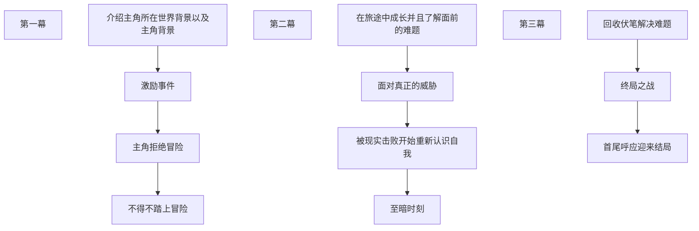

## 故事
主色调：`在混沌黑暗的世界中遇见美好与希望`
世界既不黑也不白，而是一道精致的灰
当你见证了无数悲惨无法挽回，世间苦难遍地，同时也有如烈火一般精神的人在为了他人和世界变得更好而Forge ahead
也有在苦难中知足认真活着的人，游戏中你的能力足以改变世界，在故事的尾声你会重构一个怎样的世界？

框架：
不用太局限于小说故事模版，在游戏中主角的无需内驱力也可以到达最终的目的地，玩家自带探索欲
只需要引导玩家向目的地走就好
所以只需要一句话：`为什么要冒险，因为深渊就在下方`

## 世界背景与设定
*深渊是什么？*
顾名思义，是一个无法窥见底部的、直径约一公里的圆形洞窟
*深渊是怎么来的？*
深渊一直都存在，只是人们感知不到它，直到有一天，那层屏蔽地表与深渊的那层屏障消失了
*为什么人们会去深渊里？*
游戏表层设定是深渊会激发人们的探索欲，且深渊中有大量珍宝，深渊内部有许多未知的能量在地表的人们看来说是魔法也不为过
深层含义：当一个人遭遇打击，比如失去至亲，渴望寻找意义的黑洞便会出现在人的内心，那些被困在意义中的人们
*深渊是一种环境还是一种生物呢*

人类的组成：`肉体、灵、魂`
灵承载人的记忆
肉体是灵魂与现实世界交互的媒介
魂是灵的载体，是完成灵魂生态运转的媒介，新的魂会向往新生，亡者的魂会向往深渊

*为什么要这么设定？*
我不希望人死后就是一片虚无，我想用我的方式解释世间轮回
认识一个人通常里面就可以认识到这个人的肉体，更深一步才可看到一个人的灵魂
*是什么塑造了一个人灵魂？*
这里我抛弃所有的理性单纯用感性的方式定义
万物皆有灵，我们所认识到的灵魂皆是与其他无数灵魂相互交融后的结果
所有人或事物都在相互影响相互塑造
*如何在这种设定下解释人的生死？*
肉体会衰老，魂会脱离肉身并带着灵回到深渊（随便起的）中
灵会作为养料被深渊吸收，新的魂会降临到新生
*为何死亡后会失去金币*
因为主角的灵魂不灭但是肉身死了就是死了，要重新回去拿尸体上的钱币
*为何死亡第二次后最初的金币就会消失？*
深渊的大地会吞噬尸体

## 主角
在冒险中主角发现自己与其他人不同，自己不会真正的死亡，一般的灵魂脱离肉体后会想一滴水滴入大海一般消散开来，但是主角的灵魂很特殊仿佛不是来自这个世界的一般，于深渊无法融合
*这份能力的意义是什么？*
游戏中可以设定为：主角拥有不灭的灵魂，，每一个存档点是一个可以无限创造肉身且保存主角灵魂的机器，以此来实现无限复活
深层含义中可以是拥有无法打倒的意志，在无数次否定自己，重塑自己中成长之人的内心
*主角从何而来？*
在游戏中不必过多介绍玩家控制的这个主角，重点任务塑造放在NPC上
在深层含义中主角可以是每一个试图寻找自我、救赎自我永不放弃的人
*主角的使命又是什么？*
世界病了（或者说你自己的内心世界出现了巨大的缺口），你要在冒险中感受人性，再探索中寻找自己
一路向下抵达深渊，认识世界，毁灭世界是游戏的引导也是主角的命运

## NPC

魔法师（名称待定）使用魔法

巨人族（名称待定）钢铁与力量

## 创作灵感
1. 故事的开头可以借鉴百年孤独第一句话的句式做一个记忆回述,在故事重新回到起点时间线的时候，将游戏的名称之含义展示给玩家
2. 致敬一下致不灭的你
3. 再致敬一下来自深渊
4. 游戏操作体验感借鉴空洞骑士

## 故事模版框架
#### 三幕式模版

#### 费希特曲线
在故事的一开始便制造一个又一个危机，在解决危机中介绍世界背景、人物背景，并在最大的危机中达到高潮，在故事的最后解决所有未解决问题
#### 起承转合
适合短片故事的模版
精华与灵感集中于转点上

